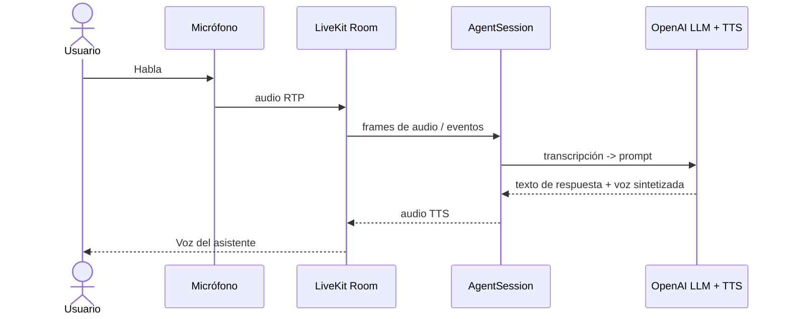
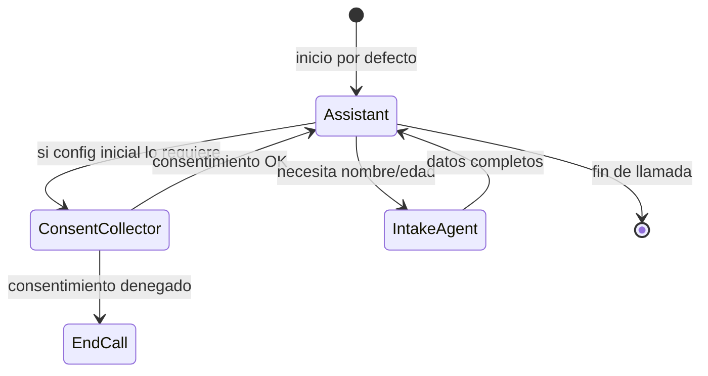

# Customer-Service Voice Agent

¡Bienvenido! Este proyecto contiene un agente de voz en tiempo real para atención al cliente construido sobre **LiveKit Agents** y los modelos de **OpenAI**. El bot puede mantener conversaciones bidireccionales por voz (STT ⇄ LLM ⇄ TTS), registrar datos del usuario y gestionar el flujo de la llamada, todo ello con cancelación de ruido y detección automática de turnos de habla.

---

## 1. ¿Para qué sirve?

• Automatizar líneas telefónicas o salas de LiveKit ofreciendo un **asistente conversacional en español**.
• Solicitar el consentimiento de grabación, recopilar nombre y edad y, en función de la respuesta, continuar la llamada, transferirla o colgarla.
• Ejemplo base para añadir más herramientas (`@function_tool`) que consulten CRMs, abran tickets, etc.

---

## 2. Instalación

Requisitos previos:
1. Python ≥ 3.11
2. Clonar el repositorio
3. [uv](https://github.com/astral-sh/uv) (gestor que sustituye a `pip` + `virtualenv`)

```bash
# Instalar uv (una sola vez)
pip install uv

# Crear y activar un entorno virtual aislado
uv venv .venv
source .venv/bin/activate       # Windows: .\.venv\Scripts\activate

# Instalar el proyecto y sus dependencias declaradas en pyproject.toml
uv pip install -e .

# Variables de entorno requeridas
export OPENAI_API_KEY="<tu-clave>"
# Si utilizas LiveKit Cloud añade LIVEKIT_API_KEY / LIVEKIT_API_SECRET / LIVEKIT_URL
```

---

## 3. Ejecución rápida

```bash
# Lanza un worker de LiveKit Agents con nuestro script de entrada
python -m app.agents.realtimeAgent

# o bien, con el CLI de LiveKit
livekit-agents run app/agents/realtimeAgent.py
```

Para probarlo localmente puedes unirte a la misma sala desde [https://livekit.io/playground](https://livekit.io/playground) u otro cliente WebRTC compatible.

---

## 4. ¿Cómo funciona?

### 4.1 Arquitectura general



### 4.2 Flujo de agentes dentro de la sesión



• **Assistant**: Agente principal, responde en español y mantiene la conversación.
• **ConsentCollector**: Pregunta si se puede grabar la llamada; si no, cuelga.
• **IntakeAgent**: Registra nombre y edad mediante herramientas tipo function-call.

---

## 5. Personalización rápida

1. Añade un nuevo `@function_tool` en `app/agents/realtimeAgent.py` para, por ejemplo, consultar tu CRM.
2. Cambia la voz (`voice="coral"`) o el idioma en la creación del modelo `openai.realtime.RealtimeModel`.
3. Sustituye `noise_cancellation.BVC()` por otro plugin o desactívalo.

---

¡Listo! Con esto tienes un bot de atención al cliente en vivo y en español totalmente funcional y extensible.
